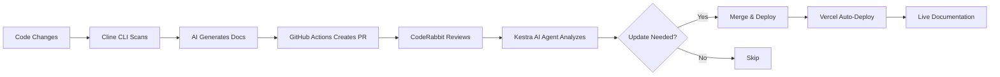

# 📚 Continuous Documentation Generator

> AI-powered automated documentation system using Cline CLI, Kestra AI Agent, CodeRabbit, and Vercel

[](https://continuous-docs-generator-etwlo7ax8-saigangadhars-projects.vercel.app)
[](https://openai.com)
[](https://github.com/cline/cline)

**🚀 Live Demo:** [https://continuous-docs-generator-etwlo7ax8-saigangadhars-projects.vercel.app](https://continuous-docs-generator-etwlo7ax8-saigangadhars-projects.vercel.app)

## 🎯 What This Does

Never manually update documentation again. This project creates a **complete automated documentation pipeline**:

1. 🤖 **Cline CLI** analyzes your code and generates comprehensive documentation automatically
2. 🧠 **Kestra AI Agent** summarizes weekly changes AND makes intelligent decisions about what needs updating
3. ✅ **CodeRabbit** reviews all documentation for quality and completeness
4. 🚀 **Vercel** deploys your docs instantly, always keeping them up-to-date

## ⚡ Quick Start

### Prerequisites
- Node.js 18+ ([Download](https://nodejs.org))
- OpenAI API key ([Get one](https://platform.openai.com/api-keys))
- GitHub account with personal access token ([Create](https://github.com/settings/tokens))

### 1. Install Dependencies

```bash
cd continuous-docs-generator

# Install Cline automation
cd cline-automation && npm install

# Install docs site
cd ../docs-site && npm install
```

### 2. Set Up API Keys

```bash
# Create Cline .env file
cat > cline-automation/.env << EOF
OPENAI_API_KEY=your_openai_key_here
GITHUB_TOKEN=your_github_token_here
EOF

# Create docs site .env file
cat > docs-site/.env.local << EOF
NEXT_PUBLIC_SITE_URL=http://localhost:3000
GITHUB_TOKEN=your_github_token_here
EOF
```

### 3. Try It Out!

**Generate documentation:**
```bash
cd cline-automation
node generate-docs.js ../sample-project
```

**View the docs site:**
```bash
cd ../docs-site
npm run dev
# Visit http://localhost:3000
```

**Deploy to Vercel:**
```bash
cd docs-site
npm install -g vercel
vercel
```

## 📁 Project Structure

```
continuous-docs-generator/
├── docs-site/              # Next.js + Nextra documentation site
│   ├── pages/
│   ├── public/
│   └── theme.config.jsx
├── cline-automation/       # Cline CLI automation scripts
│   └── generate-docs.js
├── kestra-workflows/       # Kestra workflow definitions
│   └── weekly-summary.yml
└── README.md
```

## 🔧 How It Works

### The Complete Automation Pipeline



### 1. 🤖 Cline CLI - Automated Doc Generation

**What it does:**
- Scans your entire repository
- Uses OpenAI GPT-4 to analyze code
- Generates API docs, changelogs, architecture diagrams
- Outputs clean Markdown files

**See it in action:**
```bash
cd cline-automation
node generate-docs.js ../sample-project
ls ../sample-project/generated-docs/
# api.md, changelog.md, architecture.md ✨
```

**Key code:** [generate-docs.js](./cline-automation/generate-docs.js)

### 2. 🧠 Kestra AI Agent - Intelligent Summarization & Decision-Making

**What makes this special:** The AI doesn't just summarize - it **makes decisions**!

**Kestra AI Agent:**
1. Fetches git diffs from the past week
2. Summarizes changes in plain English
3. **Analyzes impact and decides:**
   - Does API documentation need updating? (YES/NO + reason)
   - Should architecture diagrams be regenerated? (YES/NO + reason)
   - Is a rebuild needed? (YES/NO + priority)
4. Takes action based on decisions (creates PRs, triggers deployments)

**See the workflow:** [weekly-summary.yml](./kestra-workflows/weekly-summary.yml)

### 3. ✅ CodeRabbit - Quality Assurance

**What it does:**
- Automatically reviews all documentation PRs
- Checks for clarity and completeness
- Suggests improvements
- Ensures consistency with best practices

**Configuration:** [.coderabbit.yaml](./.coderabbit.yaml)

### 4. 🚀 Vercel - Instant Deployment

**What it does:**
- Deploys documentation site automatically
- Creates preview URLs for every PR
- Global CDN for fast access
- Zero-downtime deployments

**Deploy command:** `vercel`

## 💡 Usage

### Generate Docs for Your Project

```bash
cd cline-automation

# Generate docs for any repository
node generate-docs.js /path/to/your/project

# Or use current directory
node generate-docs.js .

# Specify custom output location
node generate-docs.js /path/to/project /path/to/output
```

### CI/CD Integration

The GitHub Actions workflow automatically:
1. Runs on every push to `main`
2. Generates documentation
3. Creates a PR
4. Requests CodeRabbit review
5. Deploys to Vercel on merge

See: [.github/workflows/auto-docs.yml](./.github/workflows/auto-docs.yml)

### Weekly Summaries with Kestra

Kestra runs weekly to:
- Summarize the past 7 days of changes
- Make decisions about documentation needs
- Create PRs with summaries
- Trigger rebuilds if needed

## ✨ Key Features

### For Developers
- 🔍 **Zero Manual Work** - Documentation updates automatically with code
- 📝 **AI-Powered Analysis** - GPT-4 understands your code's intent
- 📊 **Visual Diagrams** - Auto-generated architecture and flow charts
- 🔄 **Always Current** - Weekly summaries keep docs fresh

### For Teams
- 👥 **Automated Reviews** - CodeRabbit checks every documentation update
- 🎯 **Smart Decisions** - AI determines what needs updating and why
- 🚀 **Instant Deployment** - Changes go live immediately
- 📈 **Comprehensive History** - Automatic changelogs from git commits

### Technical Features
- ✅ **Multi-language Support** - JavaScript, TypeScript, Python, Java, Go, Rust
- ✅ **Markdown Output** - Compatible with any documentation system
- ✅ **Mermaid Diagrams** - Render architecture visually
- ✅ **GitHub Integration** - Automatic PR creation and review
- ✅ **Vercel Integration** - Seamless deployment pipeline
- ✅ **Kestra Orchestration** - Complex workflows made simple

## 🧪 Testing

### Test Cline Automation

```bash
cd cline-automation
node generate-docs.js ../sample-project

# Verify output
ls ../sample-project/generated-docs/
cat ../sample-project/generated-docs/api.md
```

### Test Documentation Site

```bash
cd docs-site
npm run build
npm start

# Or for development
npm run dev
```

### Test Vercel Deployment

```bash
cd docs-site
vercel --prod
```

## 🤝 Contributing

Contributions are welcome!

1. Fork the repository
2. Create a feature branch
3. Make your changes
4. Submit a PR (CodeRabbit will review!)

## 📝 License

MIT License - see LICENSE file for details

## 🎓 Resources

- **Cline CLI:** https://github.com/cline/cline
- **Kestra:** https://kestra.io/docs
- **CodeRabbit:** https://docs.coderabbit.ai
- **Vercel:** https://vercel.com/docs
- **OpenAI API:** https://platform.openai.com/docs

## 🙏 Acknowledgments

- Cline CLI for autonomous coding capabilities
- Kestra for workflow orchestration
- CodeRabbit for AI-powered code reviews
- Vercel for seamless deployment

## 📞 Support

For questions or issues, please open a GitHub issue.

---

Built with AI-powered automation
