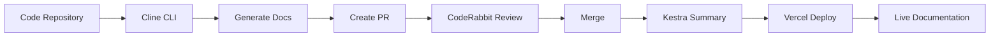

# Welcome to Continuous Documentation Generator

Welcome to the automated documentation system that keeps your docs always up-to-date!

## What is This?

This documentation site is **automatically generated and maintained** using:

- **Cline CLI** - Scans repositories and generates documentation
- **Kestra** - Orchestrates weekly updates and AI summarization
- **CodeRabbit** - Reviews documentation quality
- **Vercel** - Deploys instantly on every update

## Getting Started

<div className="steps-container" style={{ marginTop: '2rem' }}>

### Step 1: Install Cline CLI

```bash
npm install -g @cline/cli
```

### Step 2: Generate Documentation

```bash
cline generate-docs --repo=/path/to/your/project
```

### Step 3: Deploy to Vercel

```bash
vercel deploy
```

</div>

## Key Features

- 🤖 **AI-Powered** - Uses GPT-4 to understand and document code
- 🔄 **Auto-Updated** - Weekly summaries keep docs fresh
- ✅ **Quality Reviewed** - CodeRabbit ensures documentation quality
- 🚀 **Instantly Deployed** - Changes go live automatically
- 📊 **Visual Diagrams** - Auto-generated architecture diagrams

## How It Works



## Examples

Explore our automatically generated documentation:

- [API Reference](/api) - Generated from code comments
- [Architecture](/architecture) - Visualized code structure
- [Changelog](/changelog) - Auto-generated from commits
- [Weekly Updates](/updates) - AI-summarized changes

## Why Use This?

Traditional documentation becomes outdated quickly. With Continuous Documentation Generator:

✅ Docs update automatically with code changes  
✅ AI summarizes complex changes in plain English  
✅ Quality is maintained through automated reviews  
✅ No manual deployment needed  

---

Ready to get started? Check out our [Quick Start Guide](/getting-started) →
